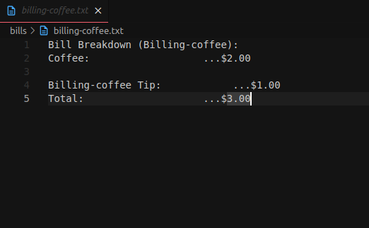

# Go Billing App CLI



This is a command-line billing application built using Go programming language. It provides a simple solution for generating a file.txt containing billing information.

## Features

- Generate a billing file.txt with billing information
- Customize billing parameters through command-line arguments

## Installation

- Clone the repository:

```shell
git clone https://github.com/soulaimaneyahya/go-billing-app-cli.git
```

### Usage

1. Compile billing-app-cli:

```sh
go mod init billing-app-cli && go mod tidy
```

```sh
make build
```

```sh
make run
```

```sh
make clean
```

## Contributing

Contributions are welcome! If you find any issues or have suggestions for improvements, please open an issue or submit a pull request.


----- 
Need helps? Reach me out

> Email: contact@soulaimaneyahya.com

All the best :beer:
